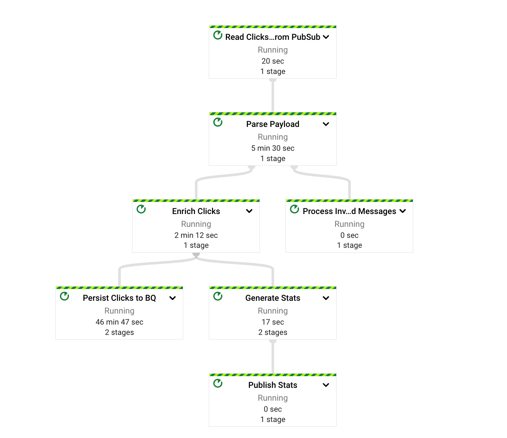

# Building, discovering and consuming data streams

Data products that are streams are typically based on Cloud Pub/Sub. For more
details
review [this section](https://cloud.google.com/architecture/build-data-products-data-mesh#data_as_streams)
of the Data Mesh guide.

To illustrate how data streams are produced and consumed we will use two
Dataflow pipelines - one to generate the input for the product and another one
to produce curated data to be consumed.

## Prerequisites

Build the base infrastructure of a data mesh organization as described in
the [parent README](../README.md). It will create all the necessary resources
and set up a number of Terraform variables needed for the scripts in this
folder.

Ensure you have Java 11 or newer compiler installed - it's needed to build the
Dataflow ingest and consumption pipelines.

## Create the infrastructure for the data ingest

In this step a new Pub/Sub topic is created where the source payloads will be
published. Also, a Cloud Storage bucket is created to store Dataflow deployment
artifacts.

```shell
cd ingest-infrastructure
terraform init
terraform apply
cd ..
```

Once the infrastructure is created, store the resource ids of the newly created
artifacts

```shell
source get-ingest-infra-ids.sh
```

## Start event generation

This step uses a
Google-provided [Streaming Data Generation](https://cloud.google.com/dataflow/docs/guides/templates/provided-utilities#streamingdatagenerator)
Dataflow template. It will generate Pub/Sub messages with a JSON payload based
on [event-generator-template.json](/streaming-product/event-generator-template.json)
. These messages will be written to an input topic in the domain's base data
project.

```shell
./start-event-generation.sh <messages-per-second>
```

Selecting `messages-per-second` parameters in low hundeds range is a good option
for this demo.

## Start the product Dataflow pipeline

```shell
./start-product-pipeline.sh
```

Once both the event generation and product pipelines start, it can take several
minutes before the data appears in the destination tables and topics.

## Examine the pipeline graph

Navigate to the pipeline monitoring URL printed to the console by
the `start-product-pipeline.sh` script. The pipeline graph will be similar to
the one below.



This pipeline performs several steps typical to ingestion pipelines:

* Validation (Parse Payload, Process Invalid Messages)
* Enrichment (Enrich Clicks)
* Persistence of the enriched data to the analytical data store (Persist Clicks
  to BQ)
* Streaming analytics (Generate Stats, Publish Stats)

Streaming analytics branch of the pipeline generates data which is exposed as a
data product - the statistics generated are published to a
Pub/Sub [topic](../infrastructure/domain/pubsub-product.tf), which
is [tagged](../infrastructure/incremental-changes/make-products-searchable/datacatalog.tf)
with the product tag template.

## Searching for the product

Potential customers can find this data stream product by using this command from
the root directory of this repo:

```shell
bin/search-products.sh "web traffic"
```

The output will be similar to this:

```shell
[
  {
    "integratedSystem": "CLOUD_PUBSUB",
    "linkedResource": "//pubsub.googleapis.com/projects/your-data-mesh-domain-product/topics/web-traffic-stats-v1",
    "modifyTime": "2022-10-07T02:34:55Z",
    "relativeResourceName": "projects/your-data-mesh-domain-product/locations/global/entryGroups/@pubsub/entries/cHJ...djE",
    "searchResultSubtype": "entry.data_stream.topic",
    "searchResultType": "ENTRY"
  }
]
```

This means that there is a Pub/Sub topic which matches the search description.
To get the details about the topic, copy the value of `relativeResourceName`
from the search result and run

```shell
bin/show-entry-details.sh <relativeResourceName>
```

This will print content of all the tags on this resource:

```shell
[
  {
    "fields": {
      "access_request_link": {
        "displayName": "Access request link",
        "order": 2,
        "stringValue": "https://streaming-network-events.wiki.corp/v1/access"
      },
      "business_owner": {
        "displayName": "Business owner",
        "order": 7,
        "stringValue": "network-events-product-owner@example.com"
      },
      "data_domain": {
        "displayName": "Data domain",
        "enumValue": {
          "displayName": "Operations"
        },
        "order": 11
      },
      "data_product_description": {
        "displayName": "Data product description",
        "order": 8,
        "stringValue": "15 minute web click counts per region generated every 5 minutes"
      },
      "data_product_name": {
        "displayName": "Data product name",
        "order": 9,
        "stringValue": "Web traffic statistics v1"
      },
      "data_product_status": {
        "displayName": "Data product status",
        "enumValue": {
          "displayName": "RELEASED"
        },
        "order": 1
      },
      ...
      "documentation_link": {
        "displayName": "Documentation Link",
        "order": 3,
        "stringValue": "https://streaming-network-events.wiki.corp/v1/overview"
      },

      "technical_owner": {
        "displayName": "Technical owner",
        "order": 6,
        "stringValue": "network-events-product-tech@example.com"
      }
    },
    "name": "projects/your-data-mesh-domain-product/locations/global/entryGroups/@pubsub/entries/cHJvamVjdHMvZ2NwLWRhdGEtbWVzaC1kb21haW4tcHJvZHVjdC90b3BpY3Mvd2ViLXRyYWZmaWMtc3RhdHMtdjE/tags/CcwopuLMtY1T",
    "template": "projects/your-data-mesh-central-catalog/locations/us-central1/tagTemplates/data_product",
    "templateDisplayName": "Data Product"
  },
  {
    "fields": {
      "description": {
        "displayName": "Description",
        "stringValue": "Web traffic by location statistics v1"
      },
      "schema_ref": {
        "displayName": "Enforced PubSub topic schema",
        "stringValue": "https://console.cloud.google.com/cloudpubsub/schema/detail/web_traffic_stats_v1?project=your-data-mesh-domain-product"
      }
    },
    "name": "projects/your-data-mesh-domain-product/locations/global/entryGroups/@pubsub/entries/cHJ...jE/tags/CU...D",
    "template": "projects/your-data-mesh-central-catalog/locations/us-central1/tagTemplates/pubsub_topic_details",
    "templateDisplayName": "PubSub Topic Details"
  }
]
```

Note: typically an organization will build a custom UI to visualize the Data
Catalog tags to the end user.

## Consume streaming data
Consumers create subscriptions to the product topic in their projects (once they
are granted the permission to do that):

```shell
cd streaming-product/consumption-infrastructure
terraform init
terraform apply
```

At this point the data should be appearing in this subscription. You can preview
the data in the subscription:

```shell
./pull-messages-from-consumer-subscription.sh <number-of-messages>
```

You should see the content of the Pub/Sub payloads:

```shell
{"country":"USA","region":"CA","start_ts":"2022-10-13T20:10:00.000Z","end_ts":"2022-10-13T20:25:00.000Z","count":21}
{"country":"Canada","region":"AB","start_ts":"2022-10-13T20:10:00.000Z","end_ts":"2022-10-13T20:25:00.000Z","count":15}
{"country":"USA","region":"AZ","start_ts":"2022-10-13T20:10:00.000Z","end_ts":"2022-10-13T20:25:00.000Z","count":21}
{"country":"Mexico","region":"JA","start_ts":"2022-10-13T20:10:00.000Z","end_ts":"2022-10-13T20:25:00.000Z","count":9}
{"country":"USA","region":"NV","start_ts":"2022-10-13T20:10:00.000Z","end_ts":"2022-10-13T20:25:00.000Z","count":11}
```

Note: sometimes not a full list of requested message is retrieved. This
is [expected behaviour](https://cloud.google.com/sdk/gcloud/reference/pubsub/subscriptions/pull)
of the gcloud command.

## Cleanup

### Stop event generation

```shell
./stop-event-generation.sh
```

### Stop product pipeline

```shell
./stop-product-pipeline.sh
```

### Delete the consumption infrastructure
```shell
cd consumption-infrastructure
terraform destroy
cd ..
```

### Delete the ingestion infrastructure
```shell
cd ingest-infrastructure
terraform destroy
cd ..
```